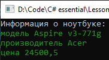

# Lesson7_addition_task
Условия задачки:
>Используя Visual Studio, создайте проект по шаблону Console Application.  
Создайте структуру с именем - Notebook.  
Поля структуры: модель, производитель, цена.  
В структуре должен быть реализован конструктор для инициализации полей и метод для вывода содержимого полей на экран.  

Подытог: вот такенный майндфак на выходе
>
